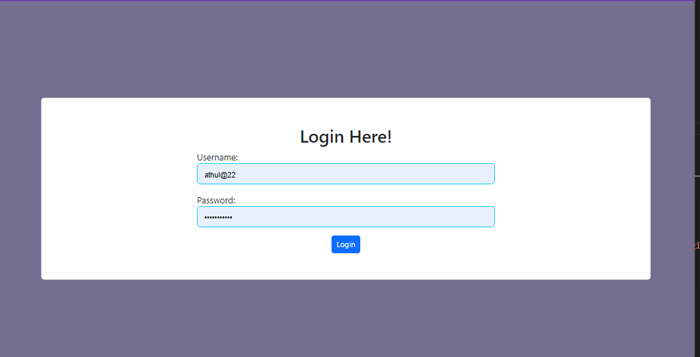
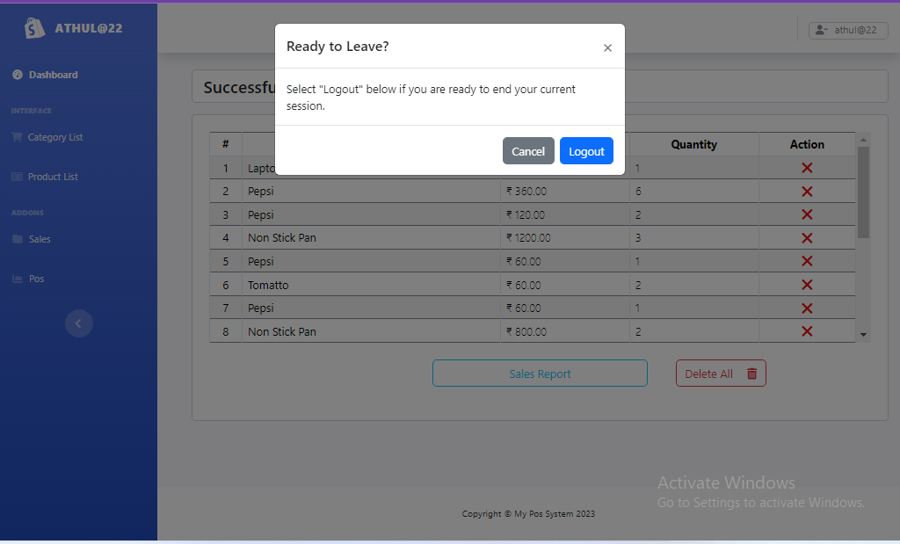
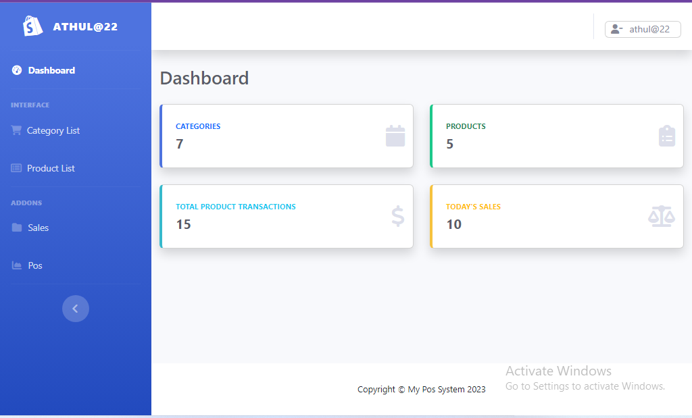
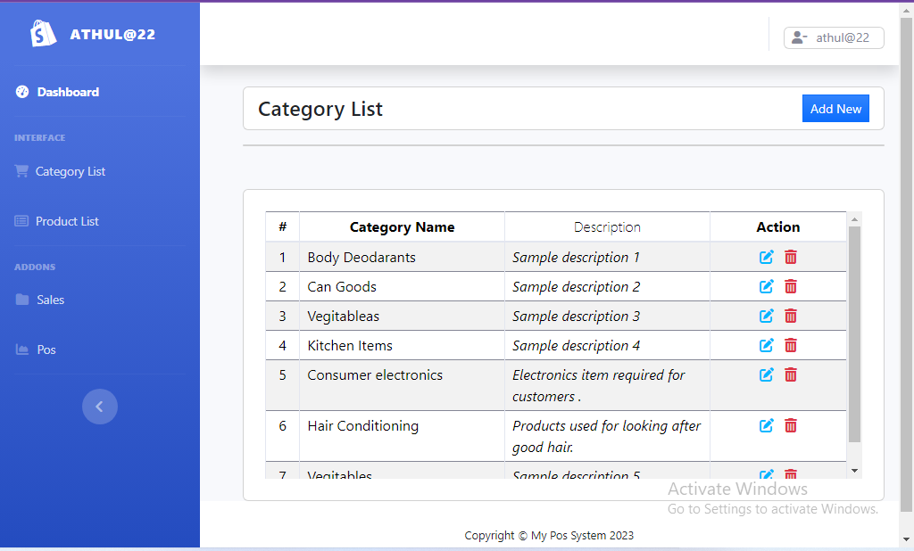
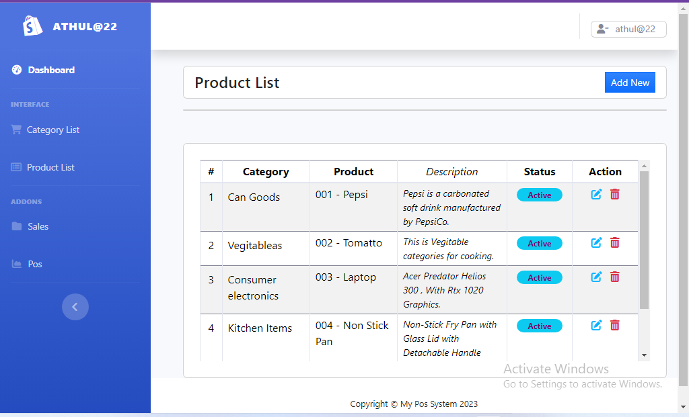
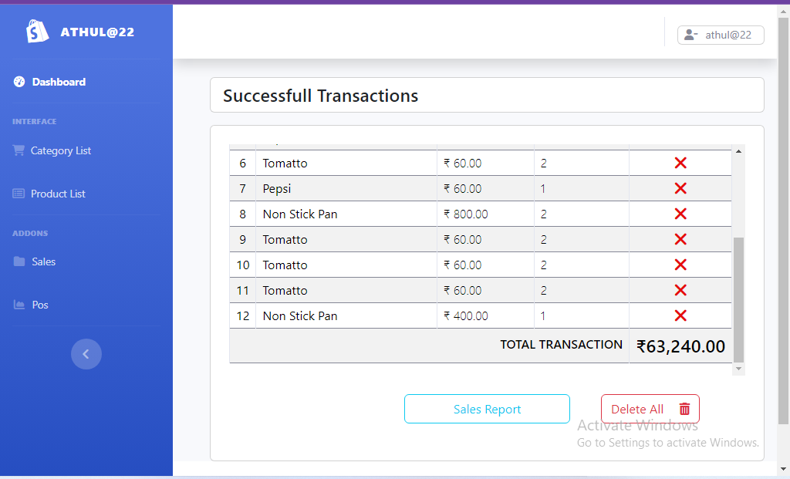
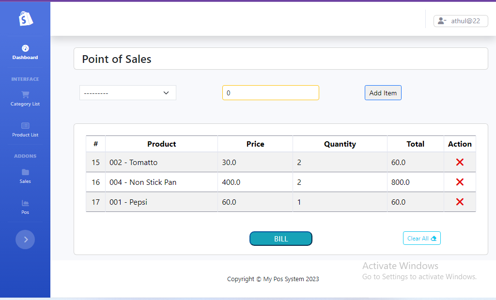
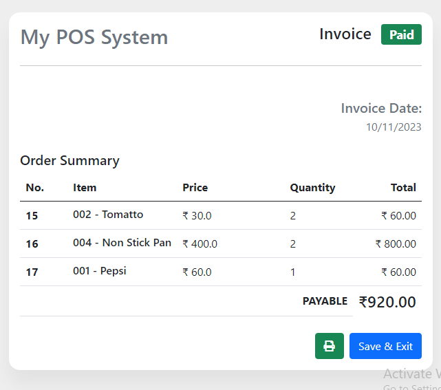
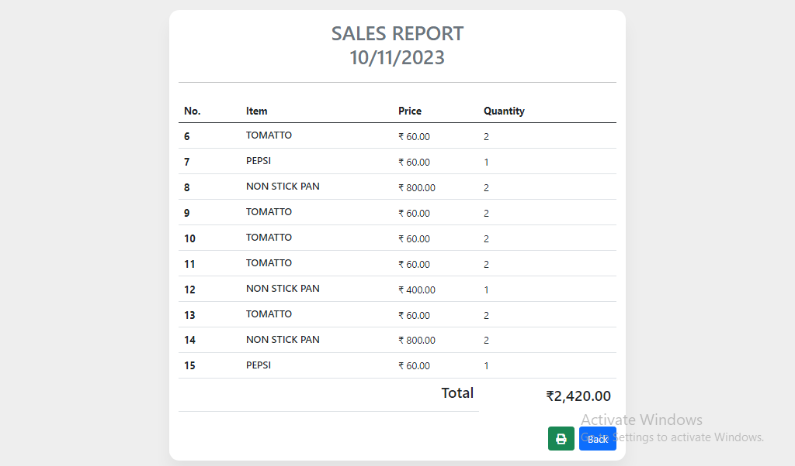

# My Mini-Point Of Sale System

*<strong>I have developed a minimal Point of Sale (POS) system
for a single retail shop using Django. The system include Category listing, Product
listings, Invoice generation, Sales report generation(per day).
Additionally, the user interface (UI) is interactive and user-friendly.</strong>*

#### Technology Used :
```python
Backend              :     Python Django

Frontend             :     Html Css Bootstrap Javascript JQuery

Database             :     MySql

Containerization     :     Docker
```
<br/>

## How to setup :

Change the directory to the location where you want the cloned directory.   
Open Gitbash 

#### Clone The Github Repository :
```
git clone https://github.com/AthulkrishnaKp/Dockerized_Django_MyPOS_System.git
```
Press Enter to create your local clone 
```
$ git clone https://github.com/AthulkrishnaKp/Dockerized_Django_MyPOS_System.git
Cloning into 'Dockerized_Django_MyPOS_System'...
remote: Enumerating objects: 1945, done.
remote: Counting objects: 100% (1945/1945), done.
remote: Compressing objects: 100% (1729/1729), done.
remote: Total 1945 (delta 210), reused 1945 (delta 210), pack-reused 0
Receiving objects: 100% (1945/1945), 5.39 MiB | 1.18 MiB/s, done.
Resolving deltas: 100% (210/210), done.
```

Open Cmd  
#### Docker :   
 
The project is designed to run with a single comand if you already have docker installed and is ready for production with just a few minimal changes. 
The main django app is build during the docker compose up command and the mysql is also setup with the same command
```sh
docker compose up -d
# or 
docker compose up -d --build 
```
The first command can be used for first time setup and subsequent runs but for the new code to push into the container you need to rebuilt the container.   
The dockerfile copies an entrypoint script into the container that is run during each up process.    
#### *<strong>It contains a simple script that checks the availability of mysqlserver before trying to migrate the models and then create a Superuser account automatically, the values for the superuser credentials can be mannualy passed or passed as environment variables.</strong>*  

* If Superuser details not manually provided Default Superuser Data Parsed automatically is:   
```sh 
        Username : athul2205       
        Password : qwerty      
        Email    : athul2205@gmail.com      
```  

Each subsequent docker compose up will not trigger a django migration nor a django super user creation it simply runs the django server . 

If any error happens during startup simple delete the folders mounted for mysql database and tmp folder of django application and run the earlier command

To access container log in the command use this code 

```sh
docker logs -f pos-app
```
After docker containerization, Go to web browser and open :
https://localhost:8000/

## Features

### Super User : 

 * Superuser only have permissions to create a User and assign their role.
    * Two roles can be assigned for the users.
       * Role 1 .   Admin
       * Role 2 .   Cashier 


### Admin User :

 * Admin have almost every features unlocked except creation of users. 
    * Only Admin users have the permission to add, delete, edit Product List, Category List.
        * Product have 2 types Active and Inactive (InActive items are not available for billing and Sales), Admin can edit their type and change to Active and Inactive.
    * Also They have permission to edit, delete Sales details & Generate Sales Report for the day.
    * Admin have permissions to perform every functionality in My Pos System.  

### Cahier :

 * User belong to this role only have permission to Calculate Bill and Generate Invoice.
   * Cashier's can also view the Product list, Category list and Sales Report.
   * Cashier also have permission to generate Sales Report but they cant edit the Sales details.  

<br/>

# Screenshots
<br/>

<div align="center"></div>
<div align="center"></div>
<div align="center"></div>
<div align="center"></div>
<div align="center"></div>
<div align="center"></div>
<div align="center"></div>

## Invoice 
<br/>

<div align="center"></div>
<br/>

## Sales Report
<br/>

<div align="center"></div>
